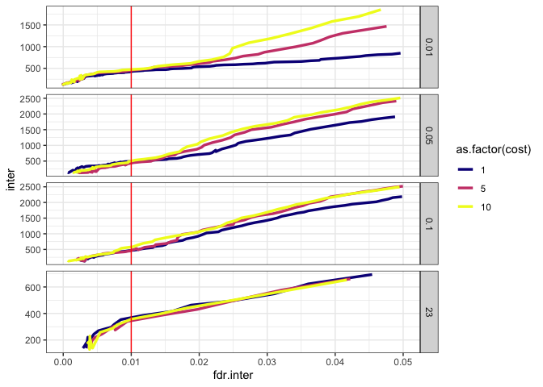
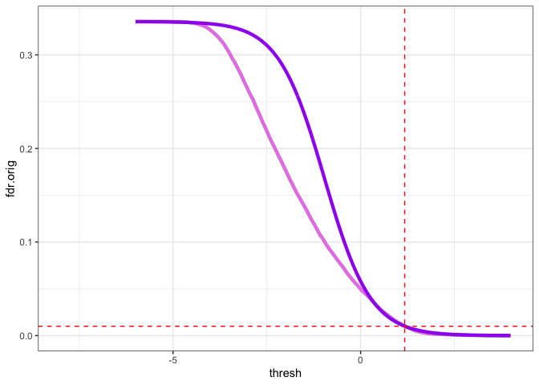
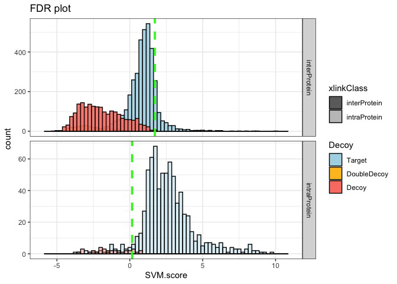
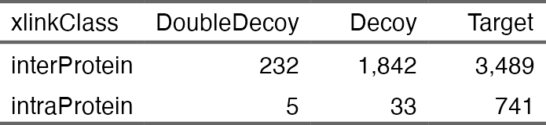

Touchstone: CLMS re-scoring, classification, biological inference and
more for Protein Prospector crosslink searches
================

<!-- README.md is generated from README.Rmd. Please edit that file -->

## Protein Prospector - Touchstone CLMS pipeline

<!-- badges: start -->
<!-- badges: end -->

The Touchstone library exists to improve the functionality of
<a href="https://prospector.ucsf.edu/prospector/mshome.htm"
target="_blank">Protein Prospector</a> for Crosslinking Mass
Spectrometry (Trnka et al. 2014). Touchstone re-scores Prospector CLMS
results using an Support Vector Machine (SVM) classifier that does a
better job discriminating between correct and incorrect crosslinks than
the Prospector scores.

It allows the user to classify datasets at a desired False Discovery
Rate (FDR) threshold at various summarization levels: Crosslinked
Spectral Matches (CSMs), Unique Residue Pairs (URPs), or Protein Pairs
(PPs). Touchstone’s FDR assessment are highly consistent with error
rates measured assessed by various benchmarking datasets (Beveridge et
al. 2020; Matzinger et al. 2022; Fischer et al. 2025).

Additionally Touchstone contains features to help with dataset
valdiation by measuring euclidean distances of crosslinks against
high-res structure files, or by querying
<a href="https://string-db.org/" target="_blank">STRING-db</a> for
String Scores of putative protein interactions.

To aid with biological inference, Touchstone can optionally classify
data into “Modules” which can designate either domains within a larger
polypeptide or stable assemblies of multiple polypeptides (or both).
There are convenience functions to export data to
<a href="https://crosslinkviewer.org/" target="_blank">XiNet</a> and
some internal plotting functions for quantitating CSMs across proteins
or modules.

Touchstone is an R package that that I developed to address my own needs
when analyzing CLMS datasets searched with Prospector, as a project
scientist supporting numerous <a
href="https://scholar.google.com/citations?hl=en&amp;user=Gae1r_AAAAAJ&amp;view_op=list_works&amp;sortby=pubdate"
target="_blank">projects</a> over the last decade or so. It is therefore
a bit niche and wasn’t developed with a wide user base in mind. Nor am I
a software developer. So, it is rough around the edges. I am sharing it
here because it might be helpful to some users, but if you are looking
for a smooth user experience that doesn’t require tinkering in R, you
might be better served by other CLMS database search and re-scoring
software.

I am currently only distributing a version here that is run in an R
command line environment, typically in
<a href="https://posit.co/download/rstudio-desktop/"
target="_blank">RStudio</a>. A demo version of a graphical interface
(built in <a href="https://shiny.posit.co/" target="_blank">Shiny</a>)
exists and is under development for eventual integration with Protein
Prospector. This will be more accesible to a wider user-base. The
eventual goal is to make Prospector CLMS searches more widely accessible
to the research community.

The graphical demo version can be accessed at
<a href="https://prospts.shinyapps.io/tstoneapp/"
target="_blank">shinyapps.io</a>

Additional instructions for the graphical demo are <a
href="https://msf.ucsf.edu/mike/crosslinkingClass/dataset_summary.html"
target="_blank">here</a>

The rest of this mini-vignette will refer to running Touchstone inside
of RStudio.

## Installation

The touchstone library is distributed on
<a href="https://github.com/" target="_blank">GitHub</a>. Install with:

``` r
# install.packages("devtools")
devtools::install_github("mtrnka/Touchstone")

library(touchstone)
library(tidyverse)
```

## 80S Ribosome data acquired by MS2.HCD.

80S ribosome was produced using a rabbit reticulocyte cell free
expression system. 80S ribosomes were crosslinked with the cleavable
reagent DSSO (Kao et al. 2011).

This ribosomal system for method development and optimization of CLMS
workflows. There is a high-res EM structure of the complex which can be
helpful in determining if the crosslinked are assigned correctly or not,
<a href="https://www.rcsb.org/structure/6hcj"
target="_blank">pdb:6HCJ</a>.

<figure>

<figcaption aria-hidden="true">cryoEM structure of Rabbit 80S
ribosome</figcaption>
</figure>

The example dataset included with Touchstone is from 80S sample, split
across 4 SEC fractions, each analyzed using a stepped-HCD MS2
acquisition cycle. Data were searched for crosslinks using Protein
Prospector program *Batch Tag*, against a protien database containing 77
ribosome sequences alongside a decoy database where each of the 77
target was randomized as well as 10x longer than the target sequences.

Touchstone expects unclassified search results with certain parameters
included in the report. The recommended Search Compare Paramters are
inlcuded as an example file:

``` r

# install.packages("jsonlite")
touchstone_example("tstoneMS2.4.json") %>% 
  jsonlite::read_json()
```

For CLMS of defined protein compleses with 2-200 subunits, I typically
use a decoy database that is either 5x or 10x larger than the target
database. This does a better job of modeling the distribution of
incorrect hits. Touchstone has a parameter called the
`decoy scaling factor` to adjust the math for this (it defaults to 1x).
The 80S ribosome search usesa decoy databse in which each decoy protein
is 10x longer than the corresponding target. If you don’t use a value
that matches the databse search conditions everything will be wrong. Set
the appropriate value for the scaling factor:

``` r

setDecoyScalingFactor(10)
```

After setting the decoy scaling factor (if needed), read the *Search
Compare* output into Touchstone:

``` r
pathToDemoFile <- touchstone_example("rRibo_DSSO_sthcd_scOut.txt")
ribo.xl <- readProspectorXLOutput(pathToDemoFile, minPepLen = 4, minIons = 0)
```

The main Touchstone function is `trainCrosslinkScore()`. Running this
will re-score prospector CLMS results by building an SVM-score.
`trainCrosslinkScore()` automatically handles hyper-paramater
optimization, feature selection, and data pre-filtering. It returns a
list with CSMs and URPs along with score thresholds that will classify
data at the target error rates. Finally it returns some information
about the features, hyperparameter values, and prefilter values selected
in the final model.

``` r
ribo.tune <- trainCrosslinkScore(ribo.xl, targetER = 0.01)
#>    index cost gamma  interInt interHits
#> 1      9   10  0.10 1532.4000       441
#> 2      8    5  0.10 1484.7500       382
#> 3      6   10  0.05 1476.5385       414
#> 4      5    5  0.05 1317.1613       378
#> 5      7    1  0.10 1311.9756       366
#> 6      4    1  0.05 1068.8378       448
#> 7      3   10  0.01  960.0000       472
#> 8      2    5  0.01  799.3200       448
#> 9      1    1  0.01  596.8750       407
#> 10    10    1 23.00  517.7143       341
#> 11    11    5 23.00  510.8000       313
#> 12    12   10 23.00  485.8333       327
```



``` r

ribo.tune
#> $CSMs
#> # A tibble: 77,657 × 78
#>    `m/z`     z Match.Int Base.Int Perc.Bond.Cleavage.1 Perc.Bond.Cleavage.2
#>    <dbl> <dbl>     <dbl>    <dbl>                <dbl>                <dbl>
#>  1 1123.     4      33.6    18622                 30.4                 35.3
#>  2 1479.     4      72.1    28673                 65.2                 45.5
#>  3 1479.     4      72.1    11208                 60.9                 42.4
#>  4 1184.     5      61.2     5892                 34.8                 27.3
#>  5 1479.     4      69.3    14587                 56.5                 45.5
#>  6  849.     4      66.7    17697                 76.5                 55.6
#>  7  849.     4      45.1    24733                 52.9                 55.6
#>  8 1059.     5      16.9   183351                 43.8                 14.8
#>  9 1059.     5      17.4    64635                 37.5                 11.1
#> 10 1059.     5      17.5    99308                 50                   11.1
#> # ℹ 77,647 more rows
#> # ℹ 72 more variables: MSMS.Ions.1 <chr>, MSMS.Ions.2 <chr>, MSMS.MZs.1 <chr>,
#> #   MSMS.MZs.2 <chr>, MSMS.Intensities.1 <chr>, MSMS.Intensities.2 <chr>,
#> #   MSMS.Errors.1 <chr>, MSMS.Errors.2 <chr>, ppm <dbl>, DB.Peptide.1 <chr>,
#> #   Peptide.1 <chr>, DB.Peptide.2 <chr>, Peptide.2 <chr>,
#> #   Elemental.Composition <chr>, Fraction <chr>, RT <dbl>, Spectrum <dbl>,
#> #   MSMS.Info <dbl>, Num.Unmat <dbl>, Num.Pks <dbl>, Score <dbl>, …
#> 
#> $URPs
#> # A tibble: 56,997 × 78
#>    `m/z`     z Match.Int Base.Int Perc.Bond.Cleavage.1 Perc.Bond.Cleavage.2
#>    <dbl> <dbl>     <dbl>    <dbl>                <dbl>                <dbl>
#>  1  701.     3      16       2620                 12.5                 12.5
#>  2  645.     3      15.9   146918                 44.4                 40  
#>  3  796.     4      28      37495                 28.6                 14.3
#>  4  545.     3      17.1    27454                100                   25  
#>  5  861.     3      11      71313                 50                   28.6
#>  6 1028.     3      25.7    70951                 62.5                 28.6
#>  7 1100.     3      43.6    98351                 57.1                 25  
#>  8 1076.     5      15      24563                 11.8                 28.6
#>  9  888.     3      39.3    28547                100                   42.9
#> 10  732.     3      42.8    46226                100                   33.3
#> # ℹ 56,987 more rows
#> # ℹ 72 more variables: MSMS.Ions.1 <chr>, MSMS.Ions.2 <chr>, MSMS.MZs.1 <chr>,
#> #   MSMS.MZs.2 <chr>, MSMS.Intensities.1 <chr>, MSMS.Intensities.2 <chr>,
#> #   MSMS.Errors.1 <chr>, MSMS.Errors.2 <chr>, ppm <dbl>, DB.Peptide.1 <chr>,
#> #   Peptide.1 <chr>, DB.Peptide.2 <chr>, Peptide.2 <chr>,
#> #   Elemental.Composition <chr>, Fraction <chr>, RT <dbl>, Spectrum <dbl>,
#> #   MSMS.Info <dbl>, Num.Unmat <dbl>, Num.Pks <dbl>, Score <dbl>, …
#> 
#> $CSM.thresh
#> $CSM.thresh$intraThresh
#> [1] -5
#> 
#> $CSM.thresh$interThresh
#> [1] 1.174
#> 
#> 
#> $URP.thresh
#> $URP.thresh$intraThresh
#> [1] 0.16
#> 
#> $URP.thresh$interThresh
#> [1] 1.718
#> 
#> 
#> $model.params
#> $model.params$kernel
#> [1] "radial"
#> 
#> $model.params$cost
#> [1] 10
#> 
#> $model.params$gamma
#> [1] 0.1
#> 
#> $model.params$sd.thresh
#> [1] 0
#> 
#> $model.params$features
#> [1] "Score.Diff"           "percMatched"          "massError"           
#> [4] "z"                    "wtURP"                "wtCSM"               
#> [7] "xlinkClass"           "Perc.Bond.Cleavage.1" "Perc.Bond.Cleavage.2"

ribo.csm <- ribo.tune$CSMs
ribo.csm.1 <- ribo.tune$CSM.thresh

# ribo.csm <- ribo.csm %>%
#   processModuleFile("inst/extdata/rRibo_newMod_uniprot.txt")
ribo.urp <- ribo.tune$URPs
ribo.urp.1 <- ribo.tune$URP.thresh

# ribo.ppi <- bestProtPair(ribo.csm)
# ribo.ppi.1 <- findSeparateThresholdsModelled(ribo.ppi, targetER = 0.01)

fdrPlots(ribo.urp, threshold=ribo.urp.1)
```



``` r
calculateFDR(ribo.urp, threshold=ribo.urp.1)
#> threshold must either be a single, numeric value or a list
#>                              with named interThresh and intraThresh valuesError in `ensym()`:
#> ! Can't convert to a symbol.
#> [1] 0.5157351

ribo.urp %>%
  countDecoys(threshold=ribo.urp.1) %>%
  flextable::flextable()
```


``` r

ribo.urp.sd.1 <- findSeparateThresholds(ribo.urp, targetER=0.01)

fdrPlots(ribo.urp, threshold=ribo.urp.sd.1, classifier="Score.Diff")
```


``` r
calculateFDR(ribo.urp, threshold=ribo.urp.sd.1)
#> threshold must either be a single, numeric value or a list
#>                              with named interThresh and intraThresh valuesError in `ensym()`:
#> ! Can't convert to a symbol.
#> [1] 0.5157351

ribo.urp %>%
  countDecoys(threshold = ribo.urp.sd.1, classifier="Score.Diff") %>%
  flextable::flextable()
```



``` r


# fdrPlots(ribo.urp, ribo.urp.1)
# calculateFDR(ribo.urp, ribo.urp.1)
# 
# fdrPlots(ribo2.urp, ribo2.urp.1)
# calculateFDR(ribo2.urp, ribo2.urp.1)
# 
# fdrPlots(ribo.urp.lin, ribo.urp.lin.1)
# calculateFDR(ribo.urp.lin, ribo.urp.lin.1)
# 
# ribo.urp %>%
#   classifyDataset(ribo.urp.1) %>%
#   countDecoys()
# 
# ribo2.urp %>%
#   classifyDataset(ribo2.urp.1) %>%
#   countDecoys()
# 
# ribo.urp.lin %>%
#   classifyDataset(ribo.urp.lin.1) %>%
#   countDecoys()
# 
# ribo.urp %>%
#   classifyDataset(ribo.urp.1) %>%
#   distancePlot2(threshold = 35)
# 
# fdrPlots(ribo.ppi, ribo.ppi.1)
# calculateFDR(ribo.ppi, ribo.ppi.1)
# 
# ribo.ppi %>%
#   classifyDataset(ribo.ppi.1) %>%
#   ggplot(aes(wtCSM)) +
#   geom_histogram(color="white") +
#   facet_grid(rows = vars(Decoy2), scales="free_y")
# 
# ribo.csm %>%
#   classifyDataset(ribo.ppi.1) %>%
#   calculatePairs() %>%
#   bestProtPair() %>%
#   ggplot(aes(wtCSM)) +
#   geom_histogram(color="white") +
#   facet_grid(rows = vars(Decoy2), scales="free_y")
```

The modulefile categorizes the 80 or so ribosomal proteins to either the
large (60S) or small (40S) subunits and specified the mapping between
the accession numbers and the pdb file.

You’ll still need to render `README.Rmd` regularly, to keep `README.md`
up-to-date. `devtools::build_readme()` is handy for this.

In that case, don’t forget to commit and push the resulting figure
files, so they display on GitHub and CRAN.

## References:

<div id="refs" class="references csl-bib-body hanging-indent"
entry-spacing="0">

<div id="ref-beveridge_synthetic_2020" class="csl-entry">

Beveridge, Rebecca, Johannes Stadlmann, Josef M. Penninger, and Karl
Mechtler. 2020. “A Synthetic Peptide Library for Benchmarking
Crosslinking-Mass Spectrometry Search Engines for Proteins and Protein
Complexes.” *Nature Communications* 11 (1): 742.
<https://doi.org/10.1038/s41467-020-14608-2>.

</div>

<div id="ref-fischer_assessment_2025" class="csl-entry">

Fischer, Lutz, Lars Kolbowski, Swantje Lenz, James E. Bruce, Robert J.
Chalkley, Michael R. Hoopmann, David D. Shteynberg, et al. 2025.
“Assessment of Reported Error Rates in Crosslinking Mass Spectrometry.”
bioRxiv. <https://doi.org/10.1101/2025.04.27.649519>.

</div>

<div id="ref-kao_development_2011" class="csl-entry">

Kao, Athit, Chi-li Chiu, Danielle Vellucci, Yingying Yang, Vishal R.
Patel, Shenheng Guan, Arlo Randall, Pierre Baldi, Scott D. Rychnovsky,
and Lan Huang. 2011. “Development of a Novel Cross-Linking Strategy for
Fast and Accurate Identification of Cross-Linked Peptides of Protein
Complexes \*.” *Molecular & Cellular Proteomics* 10 (1).
<https://doi.org/10.1074/mcp.M110.002212>.

</div>

<div id="ref-matzinger_mimicked_2022" class="csl-entry">

Matzinger, Manuel, Adrian Vasiu, Mathias Madalinski, Fränze Müller,
Florian Stanek, and Karl Mechtler. 2022. “Mimicked Synthetic Ribosomal
Protein Complex for Benchmarking Crosslinking Mass Spectrometry
Workflows.” *Nature Communications* 13 (1): 3975.
<https://doi.org/10.1038/s41467-022-31701-w>.

</div>

<div id="ref-trnka_matching_2014" class="csl-entry">

Trnka, Michael J., Peter R. Baker, Philip J. J. Robinson, A. L.
Burlingame, and Robert J. Chalkley. 2014. “Matching Cross-Linked Peptide
Spectra: Only as Good as the Worse Identification \*.” *Molecular &
Cellular Proteomics* 13 (2): 420–34.
<https://doi.org/10.1074/mcp.M113.034009>.

</div>

</div>
