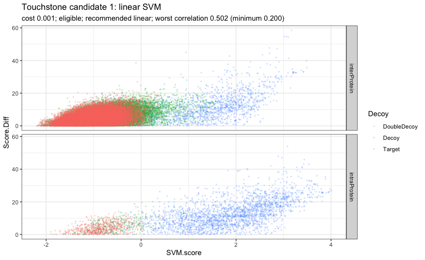
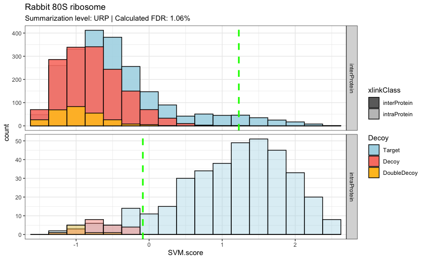
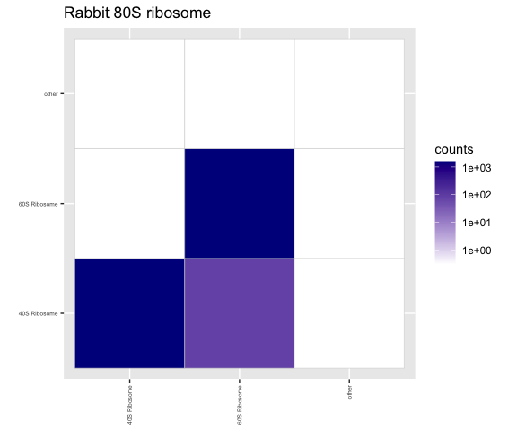
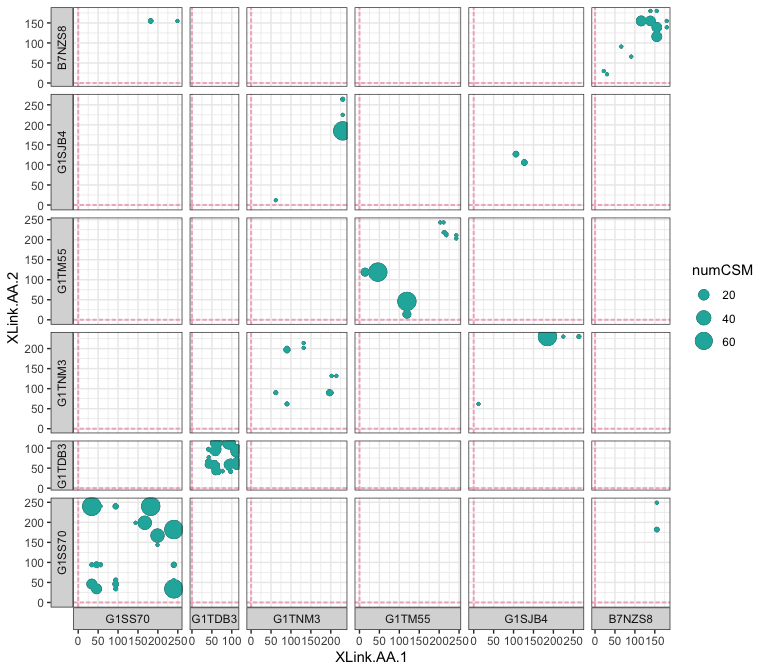
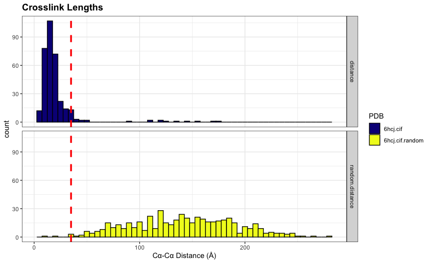
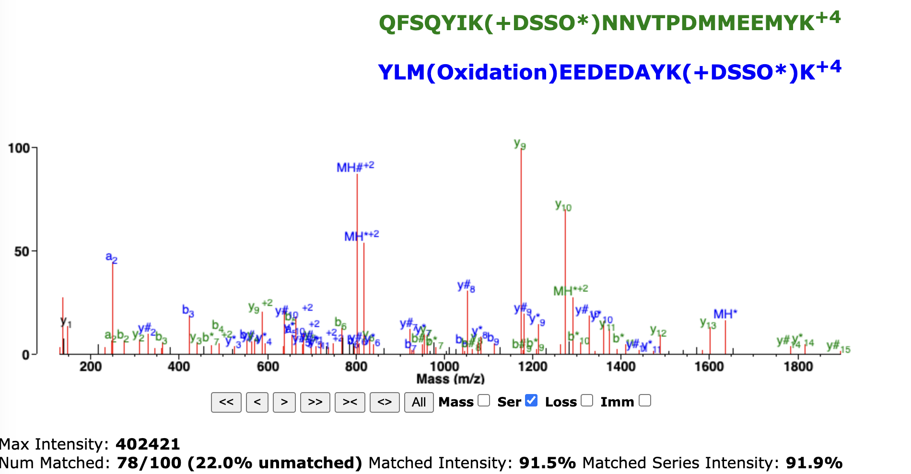
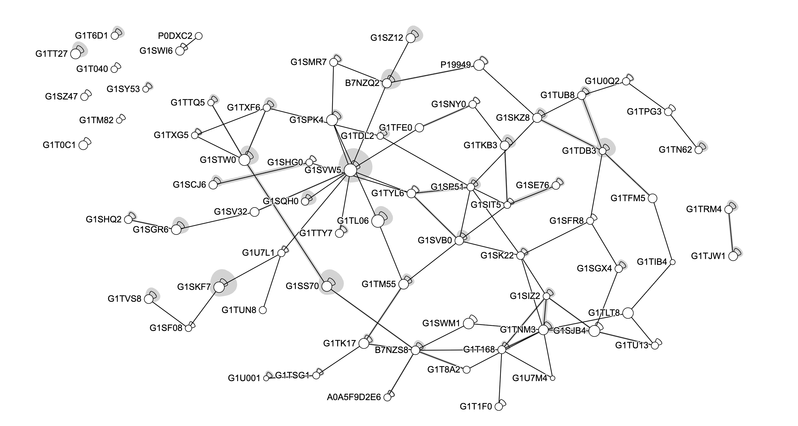
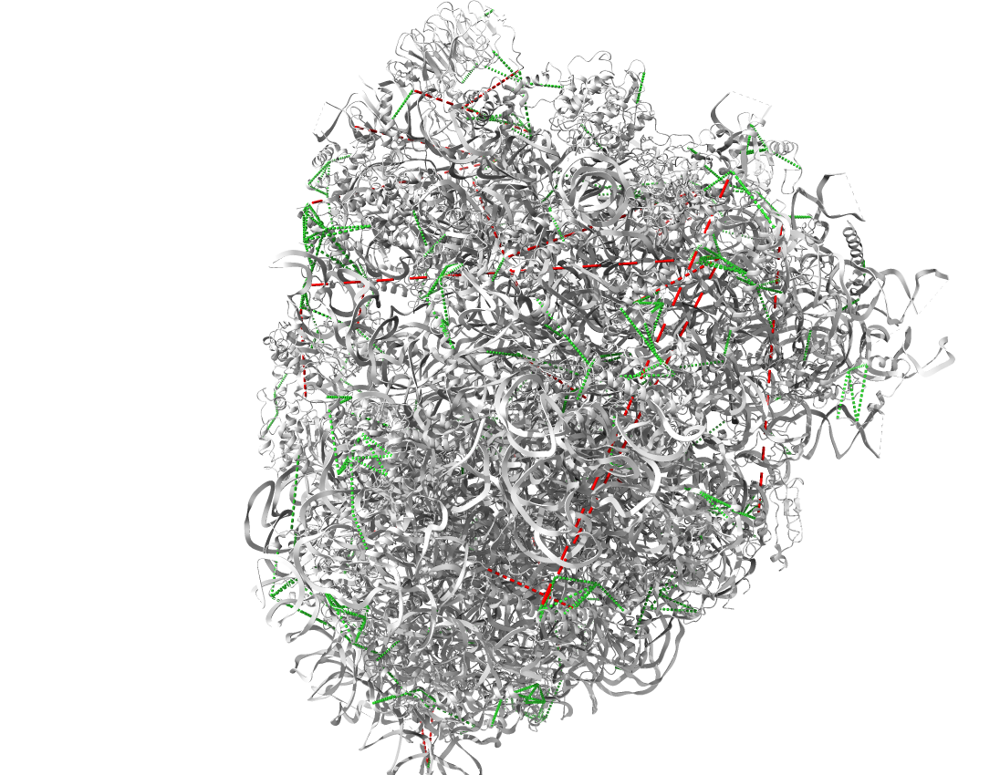

Touchstone
================

<!-- README.md is generated from README.Rmd. Please edit README.Rmd. -->
<!-- Release example validated with touchstone 0.1.0. -->

## Crosslinking mass-spectrometry rescoring and reporting

Touchstone is an R package for rescoring and classifying crosslinking
mass-spectrometry (CLMS/XL-MS) results from [Protein
Prospector](https://prospector.ucsf.edu/prospector/mshome.htm). It
builds a support-vector-machine score from Search Compare output,
estimates separate intra- and interprotein false-discovery-rate (FDR)
thresholds, and prepares results at several proteomics summarization
levels.

The current workflow supports:

- crosslinked spectrum matches (`"csm"`);
- unique residue pairs (`"urp"`);
- peptide pairs (`"peptide-pair"`);
- protein pairs (`"protein-pair"`); and
- user-defined module pairs (`"module-pair"`).

Model fitting, statistical classification, and optional evidence-quality
polishing are kept separate. Linear SVMs are the conservative default,
and the recommended score averages three reproducible cross-fitted
estimates. The Score.Diff training prefilter, feature profile, and SVM
cost can be selected automatically or fixed for a prespecified analysis.

Touchstone was developed for Protein Prospector CLMS workflows (Trnka et
al. 2014). It currently assumes familiarity with R and with the
decoy-search design used to generate the Prospector results.

## Installation

Touchstone is currently installed from GitHub:

``` r
install.packages("remotes")
remotes::install_github("mtrnka/Touchstone")
library(touchstone)
```

The example below is included with the package and can be run in a fresh
R session after installation.

## Prospector–Touchstone workflow

A typical analysis moves through the following stages:

1.  **Search spectra in Protein Prospector Batch-Tag.** Search target
    and decoy protein sequences using the crosslinker, instrument, and
    decoy-database design appropriate to the experiment.
2.  **Prepare the Touchstone report in Search Compare.** Combine the
    Batch-Tag results and export a crosslinked-peptide report. The
    bundled `tstoneMS2.4.json` template requests the score, accession,
    peptide, residue, precursor, and MS-Product-derived product-ion
    information used by Touchstone, including annotated ions and percent
    bond cleavage. It also creates the filtered peak-list file used for
    downstream spectral review in MS-Viewer.
3.  **Import the Search Compare table.** `readProspectorXLOutput()`
    standardizes Prospector column names, constructs crosslink
    identities, and calculates features needed downstream.
4.  **Train the classifier.** `trainCrosslinkScore()` selects the
    feature profile, training prefilter, and linear SVM model, then
    scores every input CSM.
5.  **Prepare a reporting level.** `prepareCrosslinkResults()`
    summarizes the scored CSMs as CSMs, unique residue pairs, peptide
    pairs, protein pairs, or module pairs and estimates level-specific
    thresholds.
6.  **Classify and polish.** `classifyCrosslinkResults()` applies
    optional evidence-quality rules, recalculates support counts, and
    produces the final target-and-decoy result table.
7.  **Add module and structural information.** A Touchstone module file
    can map accessions to complexes, subunits, domains, and structure
    chains.
8.  **Report, visualize, and export.** Touchstone provides FDR, pair,
    module, and distance plots; compact result tables; MS-Viewer and
    xiView/xiNet output; ChimeraX pseudobonds; and optional STRING-DB
    interaction scores.

The statistical classifier and reporting level are deliberately
separate: one CSM score can support several independently thresholded
result tables.

## Worked example: DSSO-crosslinked rabbit 80S ribosome

The example is a stepped-HCD MS2 analysis of rabbit 80S ribosomes
produced in a reticulocyte cell-free expression system and crosslinked
with DSSO (Kao et al. 2011). The Search Compare table contains eight
LC-MS runs covering four size-exclusion-chromatography fractions and two
replicate series. The search database contains 77 ribosomal proteins
plus randomized decoy sequences that are ten times longer than their
corresponding targets.

### 1. Read the Search Compare output

The decoy scaling factor must match the database used for the Prospector
search. An incorrect value changes every FDR calculation. This example
uses a 10-fold decoy database:

``` r
library(touchstone)

setDecoyScalingFactor(10)

ribo <- readProspectorXLOutput(
  touchstone_example("M6.sthcd_scout.txt"),
  minPepLen = 4,
  minIons = 0
)

ribo_target_csms <- removeDecoys(ribo)

c(
  CSM_candidates = nrow(ribo),
  target_accessions = length(unique(c(
    ribo_target_csms$Acc.1,
    ribo_target_csms$Acc.2
  )))
)
#>    CSM_candidates target_accessions
#>             58987                77
```

`minIons = 0` deliberately avoids filtering product-ion evidence during
import. The evidence-quality rule is applied later, after model fitting.
This keeps the statistical training decision distinct from the reporting
policy.

The recommended Prospector Search Compare parameter template can be
located with:

``` r
search_compare_template <- touchstone_example("tstoneMS2.4.json")
basename(search_compare_template)
#> [1] "tstoneMS2.4.json"
```

Some evidence-polishing features depend on optional MS-Product-derived
columns. Touchstone continues without a requested optional field and
records that the corresponding polishing rule was unavailable.

### 2. Train the crosslink score

`trainCrosslinkScore()` chooses a complexity-appropriate feature
profile, optionally selects a training-only Score.Diff threshold,
evaluates the requested hyperparameters once, and then averages three
fits of the selected model. All input CSMs are scored, including rows
excluded from the training subset.

For a completely automatic analysis, use:

``` r
ribo_training <- trainCrosslinkScore(ribo, targetER = 0.01)
```

The fully automatic run on this bundled dataset selects a Score.Diff
prefilter of `0` and linear cost `0.001`. The executable README pins
those validated choices to avoid repeating the exploratory prefilter and
cost grids every time the documentation is rebuilt:

``` r
ribo_training <- trainCrosslinkScore(
  ribo,
  targetER = 0.01,
  scoreDiffPrefilter = 0,
  cost_values = 0.001
)

ribo_training
#> Touchstone training result: recommended linear candidate 1.
#> Decoy scaling factor: 10.
#> Complexity profile: medium (77 supported proteins; 56 with intra-protein support; 77 raw target accessions).
#> Features: Score.Diff, percMatched, massError, z, CSMsupport, xlinkClass, Perc.Bond.Cleavage.1, Perc.Bond.Cleavage.2.
#> Recommended scores average 3 cross-fitted estimates.
#> Selected Score.Diff prefilter: 0.
#> # A tibble: 1 × 17
#>   index kernel  cost gamma interHits intraHits achievedFDR interCorrelation intraCorrelation
#>   <int> <chr>  <dbl> <dbl>     <dbl>     <dbl>       <dbl>            <dbl>            <dbl>
#> 1     1 linear 0.001    NA       139       374      0.0107            0.564            0.574
#> # ℹ 8 more variables: interTailCorrelation <dbl>, intraTailCorrelation <dbl>,
#> #   worstClassCorrelation <dbl>, minimumCorrelationRequired <dbl>, selectionBasis <chr>,
#> #   eligible <lgl>, recommended <lgl>, recommendedRadial <lgl>
#> Full candidate audit: $candidates
```

The printed result reports the chosen complexity profile, features,
prefilter, decoy scaling factor, ensemble size, and candidate audit. The
complete audit is available as `ribo_training$candidates`, and the
shared settings are in `ribo_training$settings`.

### 3. Inspect score behavior

The trained score should retain a sensible within-class relationship
with the original Prospector Score.Diff. This diagnostic is particularly
important when testing flexible radial kernels or new features:

``` r
plotScoreCorrelation(
  ribo_training,
  alpha = 0.18,
  pointSize = 0.45
)
```



The recommended linear model is stored in `ribo_training$recommended`.
Radial models are not trained unless explicitly requested with
`kernels = c("linear", "radial")`.

### 4. Prepare results at the URP level

Training produces one CSM-level score. Reporting thresholds are
estimated separately at each summarization level. Here the complete
scored CSM table is summarized as unique residue pairs:

``` r
ribo_urp <- prepareCrosslinkResults(
  ribo_training,
  summarizationLevel = "urp"
)

ribo_urp$thresholds
#> $intraThresh
#> [1] -0.092936
#>
#> $interThresh
#> [1] 1.186
#>
#> attr(,"thresholdMethods")
#>     intraProtein     interProtein
#>      "empirical" "logistic-model"
#> attr(,"targetFDRReached")
#> intraProtein interProtein
#>         TRUE         TRUE
```

The prepared object retains the complete target-and-decoy URP table, its
CSM source, thresholds, settings, and classification summaries. It can
therefore be plotted before classification:

``` r
fdrPlots(
  ribo_urp,
  xLimits = c(-1.5, 2.5),
  title = "Rabbit 80S ribosome"
)
```



The interprotein FDR curve is modeled because sparse decoys can make the
raw empirical curve jagged. The requested FDR is an estimate, not a
requirement that every raw count-based diagnostic fall below a hard
maximum.

### 5. Classify and polish the results

`classifyCrosslinkResults()` applies the evidence policy to the scored
CSMs, re-estimates the reporting-level thresholds, and recalculates
`numCSM` and `numURP` from evidence that passes the final policy. By
default, each peptide must have at least three distinct annotated
product-ion cleavage positions when those annotations are available:

``` r
ribo_report <- classifyCrosslinkResults(ribo_urp)

ribo_report$polishingAudit
#> # A tibble: 2 × 7
#>   rule      value                                   before after removed applied reason
#>   <chr>     <chr>                                    <int> <int>   <int> <lgl>   <chr>
#> 1 minIons   3                                        58987 32576   26411 TRUE    <NA>
#> 2 threshold intraThresh=-0.18368, interThresh=1.168  32576  3347   29229 TRUE    <NA>

ribo_classification_summary <- countDecoys(ribo_report)

ribo_classification_summary
#> # A tibble: 2 × 5
#> # Groups:   xlinkClass, Decoy [2]
#>   xlinkClass   Decoy Target DoubleDecoy   FDR
#>   <chr>        <int>  <int>       <dbl> <dbl>
#> 1 interProtein     1    140          NA  0.71
#> 2 intraProtein     4    368          NA  1.09
ribo_report$fdrByClass
#> # A tibble: 2 × 2
#>   xlinkClass       FDR
#>   <chr>          <dbl>
#> 1 interProtein 0.0107
#> 2 intraProtein 0.00995
```

`countDecoys()` provides the target and scaling-adjusted decoy count
summary. The exact class-specific FDR calculation is retained in
`fdrByClass`. This analysis reports 140 interprotein and 368
intraprotein target URPs at the modeled 1% thresholds after polishing.

The final target-only table is obtained without storing another
permanent copy inside the result object:

``` r
ribo_targets <- removeDecoys(ribo_report$data)
ribo_table <- formatXLTable(ribo_targets)
ribo_table[1:5, c(
  "xlinkedResPair", "xlinkClass", "SVM.score", "numCSM"
)]
#> # A tibble: 5 × 4
#>   xlinkedResPair            xlinkClass   SVM.score numCSM
#>   <fct>                     <fct>            <dbl>  <int>
#> 1 113.G1T6D1::75.G1T6D1     intraProtein      3.76    120
#> 2 119.G1TM55::46.G1TM55     intraProtein      3.65     74
#> 3 38.G1TUB8::67.G1TUB8      intraProtein      3.44     84
#> 4 139.B7NZS8::68.A0A5F9D2E6 interProtein      3.36     58
#> 5 42.G1SP51::78.G1SP51      intraProtein      3.33     11
```

`formatXLTable()` removes most internal columns, arranges rows by the
active classifier, and retains commonly used identification, score,
annotation, and support columns. Supply `extraCols` to preserve
additional experimental fields.

More stringent policies can be requested explicitly. For example:

``` r
ribo_stringent <- classifyCrosslinkResults(
  ribo_urp,
  polishing = list(
    minIons = 4,
    minPepLen = 5,
    minLadderCoverage = 0.25
  )
)
```

If product-ion annotations are absent, `fallbackMinScoreDiff` can be
supplied alongside `minIons`; Touchstone records whether the ion rule,
fallback, or neither was applied.

### 6. Change the reporting level

The SVM is not retrained for each reporting level. The same scored CSM
table can be prepared and classified as peptide pairs or protein pairs:

``` r
ribo_peptide_pairs <- prepareCrosslinkResults(
  ribo_training,
  summarizationLevel = "peptide-pair"
) |>
  classifyCrosslinkResults()

ribo_protein_pairs <- prepareCrosslinkResults(
  ribo_training,
  summarizationLevel = "protein-pair",
  targetER = 0.05
) |>
  classifyCrosslinkResults()
```

This separation is important: the CSM score is shared, but the FDR
threshold and supporting-evidence counts belong to the requested
reporting level. Here, the protein-pair results are deliberately
reclassified at a 5% target error rate without retraining the CSM-level
SVM.

### 7. Add module and structural annotations

The bundled module file maps ribosomal proteins to the 40S and 60S
subunits and to the rabbit 80S structure [PDB
6HCJ](https://www.rcsb.org/structure/6HCJ). Module assignment itself is
local and can be used without a structure:

``` r
ribo_module_file <- readModuleFile(
  touchstone_example("rRibo_modfile_uniprot.txt")
)

ribo_modules <- assignModules(ribo_report$data, ribo_module_file)
```

`moduleTilePlot()` summarizes the supporting CSM count between modules.
Here the ribosome module definition contains two modules, corresponding
to the small and large subunits:

``` r
moduleTilePlot(
  ribo_modules,
  threshold = -Inf,
  title = "Rabbit 80S ribosome",
  clearDiag = TRUE
)
```



`pairPlot()` displays residue positions for individual protein pairs,
with point size representing CSM support. A complete 77-protein ribosome
grid is too dense for this README, so this example selects the six 40S
proteins with the greatest total CSM support. Point sizes are capped at
70 CSMs for display:

``` r
ribo_40s <- ribo_modules |>
  dplyr::filter(
    Decoy == "Target",
    Module.1 == "40S Ribosome",
    Module.2 == "40S Ribosome"
  )

protein_support <- dplyr::bind_rows(
  dplyr::transmute(ribo_40s, Acc = as.character(Acc.1), CSMs = numCSM),
  dplyr::transmute(ribo_40s, Acc = as.character(Acc.2), CSMs = numCSM)
) |>
  dplyr::group_by(Acc) |>
  dplyr::summarise(CSMs = sum(CSMs), .groups = "drop") |>
  dplyr::arrange(dplyr::desc(CSMs))

top_40s <- utils::head(protein_support$Acc, 6)
focused_40s <- ribo_40s |>
  dplyr::filter(
    as.character(Acc.1) %in% top_40s,
    as.character(Acc.2) %in% top_40s
  ) |>
  dplyr::mutate(numCSM = pmin(numCSM, 70L)) |>
  droplevels()

pairPlot(
  focused_40s,
  modTab = dplyr::filter(ribo_module_file, Acc %in% top_40s),
  accOrder = top_40s
)
```



`processModuleFile()` combines module assignment with structure mapping
and distance calculation. If the coordinate file is not found locally,
Touchstone downloads it from the Protein Data Bank. This example
therefore requires an internet connection when first run:

``` r
set.seed(1)
ribo_structural <- processModuleFile(
  ribo_report$data,
  touchstone_example("rRibo_modfile_uniprot.txt"),
  pdbFileDir = tempdir()
)

distancePlot2(
  removeDecoys(ribo_structural),
  threshold = 35
)
```



The upper panel shows experimentally observed crosslink distances; the
lower panel shows randomly sampled lysine–lysine distances from the same
structure. The dashed line marks the chosen 35 Å distance threshold.

### 8. Export and external interaction evidence

The compact table can be renamed for MS-Viewer and written as a
tab-delimited file:

``` r
msviewer_table <- formatXLTable(ribo_targets, msviewer = TRUE)
readr::write_tsv(msviewer_table, "ribosome_urp_msviewer.txt")
```

[MS-Viewer](https://msviewer.ucsf.edu/cgi-bin/msform.cgi?form=msviewer)
requires both this result table and the corresponding peak list. The
recommended `tstoneMS2.4.json` Search Compare template creates the
filtered peak-list file that serves as the spectral input to MS-Viewer.



MS-Viewer provides interactive inspection of the matched product ions
for each reported crosslinked spectrum.

[xiView](https://www.xiview.org/) and its xiNet network view use a
smaller five-column crosslink table. The score column is inherited from
a `touchstone_results` object or can be supplied explicitly:

``` r
xiview_table <- makeXiNetFile(
  ribo_targets,
  flavor = "xiView",
  classifier = "SVM.score"
)
readr::write_csv(xiview_table, "ribosome_xiview.csv")
```



The xiNet network view summarizes protein connectivity across the
classified ribosome URPs.

After structural annotation, Touchstone can write a [UCSF
ChimeraX](https://www.cgl.ucsf.edu/chimerax/) pseudobond file. Links at
or below the distance threshold and violations are assigned different
colors:

``` r
makeChimeraXpbondFile(
  removeDecoys(ribo_structural),
  threshold = 35,
  model.id = "#1",
  out.file = "ribosome_6hcj.pb"
)
```



In this ChimeraX view of PDB 6HCJ, green pseudobonds satisfy the 35 Å
distance threshold and red pseudobonds exceed it.

For protein-pair analysis, `getStringScores()` adds STRING-DB
interaction scores as orthogonal evidence. It requires the optional
`STRINGdb` package and network access and is not part of the FDR
calculation:

``` r
ribo_protein_pairs <- prepareCrosslinkResults(
  ribo_training,
  summarizationLevel = "protein-pair",
  targetER = 0.05
) |>
  classifyCrosslinkResults()

ribo_protein_pairs_with_string <- getStringScores(
  ribo_protein_pairs$data,
  ncbiTaxonomyCode = 9986
)
```

## Scope and development status

The stabilized public path is currently binary-crosslink MS2 analysis
from Protein Prospector Search Compare output. Experimental MS3
reconstruction, ternary crosslinks, adapters for other search engines,
and a secondary protein-pair evidence score remain on the project
roadmap. In particular, the current `URPsupport` feature materially
improves large-dataset URP recovery but should not be interpreted as a
complete solution to protein-pair scoring.

A demonstration graphical interface is available at
[shinyapps.io](https://prospts.shinyapps.io/tstoneapp/), with additional
[instructions](https://msf.ucsf.edu/mike/crosslinkingClass/dataset_summary.html).
Modernizing this graphical interface and integrating it directly with
Protein Prospector are ongoing, high-priority development goals.

## References

<div id="refs" class="references csl-bib-body hanging-indent"
entry-spacing="0">

<div id="ref-kao_development_2011" class="csl-entry">

Kao, Athit, Chi-li Chiu, Danielle Vellucci, Yingying Yang, Vishal R.
Patel, Shenheng Guan, Arlo Randall, Pierre Baldi, Scott D. Rychnovsky,
and Lan Huang. 2011. “Development of a Novel Cross-Linking Strategy for
Fast and Accurate Identification of Cross-Linked Peptides of Protein
Complexes \*.” *Molecular & Cellular Proteomics* 10 (1).
<https://doi.org/10.1074/mcp.M110.002212>.

</div>

<div id="ref-trnka_matching_2014" class="csl-entry">

Trnka, Michael J., Peter R. Baker, Philip J. J. Robinson, A. L.
Burlingame, and Robert J. Chalkley. 2014. “Matching Cross-Linked Peptide
Spectra: Only as Good as the Worse Identification \*.” *Molecular &
Cellular Proteomics* 13 (2): 420–34.
<https://doi.org/10.1074/mcp.M113.034009>.

</div>

</div>
