Touchstone: CLMS re-scoring, classification, biological inference and
more for Protein Prospector crosslink searches
================

<!-- README.md is generated from README.Rmd. Please edit that file -->

## Protein Prospector - Touchstone CLMS pipeline

<!-- badges: start -->
<!-- badges: end -->

The Touchstone library exists to extend and improve the functionality of
<a href="https://prospector.ucsf.edu/prospector/mshome.htm"
target="_blank">Protein Prospector</a> for Crosslinking Mass
Spectrometry (Trnka et al. 2014). Touchstone re-scores Prospector CLMS
results using a Support Vector Machine (SVM) classifier that does a
better job discriminating between correct and incorrect crosslinks than
the internal Prospector scores.

Touchstone allows the user to classify datasets at a desired False
Discovery Rate (FDR) threshold at various summarization levels:
Crosslinked Spectral Matches (CSMs), Unique Residue Pairs (URPs), or
Protein Pairs (PPs). Touchstone’s FDR assessments are highly consistent
with ‘ground truth’ error rates assessed by various benchmarking
datasets (Beveridge et al. 2020; Matzinger et al. 2022; Fischer et al.
2025).

Additionally Touchstone contains features to help with dataset
validiation by measuring euclidean distances of crosslinks against
high-res structure files, or by querying
<a href="https://string-db.org/" target="_blank">STRING-db</a> for
String Scores of putative protein interactions.

To aid with biological inference, Touchstone can optionally classify
data into “Modules” which can designate either domains within a larger
polypeptide or stable assemblies of multiple polypeptides (or both).
There are convenience functions to export data to
<a href="https://crosslinkviewer.org/" target="_blank">XiNet</a> and
some internal plotting functions for quantitating CSMs across proteins
or modules.

Touchstone is an R package that that I developed to address my own needs
when analyzing CLMS datasets searched with Prospector, as a project
scientist supporting numerous <a
href="https://scholar.google.com/citations?hl=en&amp;user=Gae1r_AAAAAJ&amp;view_op=list_works&amp;sortby=pubdate"
target="_blank">projects</a> over the last decade or so. It is therefore
a bit niche and wasn’t developed with a wide user base in mind. Nor am I
a software developer, so it is rough around the edges. I am sharing it
here because it might be helpful to some users, but if you are looking
for a smooth user experience that doesn’t require tinkering in R, you
might be better served by other CLMS database search and re-scoring
software.

I am currently only distributing a version here that is run in an R
command line environment, typically in
<a href="https://posit.co/download/rstudio-desktop/"
target="_blank">RStudio</a>. A demo version of a graphical interface
(built in <a href="https://shiny.posit.co/" target="_blank">Shiny</a>)
exists and is under development for eventual integration with Protein
Prospector. This will be more accesible to a wider user-base. The
eventual goal is to make Prospector CLMS searches more widely accessible
to the research community.

The graphical demo version can be accessed at
<a href="https://prospts.shinyapps.io/tstoneapp/"
target="_blank">shinyapps.io</a>

Additional instructions for the graphical demo are <a
href="https://msf.ucsf.edu/mike/crosslinkingClass/dataset_summary.html"
target="_blank">here</a>

The rest of this mini-vignette will refer to running Touchstone inside
of RStudio.

## Installation

The touchstone library is distributed on
<a href="https://github.com/" target="_blank">GitHub</a>. This demo also
uses the tidyverse ecosystem extensively. Install with:

``` r
demo_pkgs <- c("devtools", "tidyverse")
pks_to_install <- demo_pkgs[!demo_pkgs %in% installed.packages()]
if (length(pks_to_install) > 0) install.packages(pks_to_install)
lapply(demo_pkgs, library, character.only = TRUE)

devtools::install_github("mtrnka/Touchstone")
library(touchstone)
```

## 80S Ribosome data acquired by MS2.HCD.

80S ribosome was produced using a rabbit reticulocyte cell free
expression system. 80S ribosomes were crosslinked with the cleavable
reagent DSSO (Kao et al. 2011). I use this system for method development
and optimization of CLMS workflows. There is a high-res EM structure of
the complex which can be helpful in determining if the crosslinked are
assigned correctly or not, <a href="https://www.rcsb.org/structure/6hcj"
target="_blank">pdb:6HCJ</a>.

<figure>

<figcaption aria-hidden="true">cryoEM structure of Rabbit 80S
ribosome</figcaption>
</figure>

The example dataset included with Touchstone is from the 80S sample,
split across 4 SEC fractions, each analyzed using a stepped-HCD MS2
acquisition cycle. Data were searched for crosslinks using Protein
Prospector program *Batch Tag*, against a protien database containing 77
ribosome sequences alongside a decoy database where each of the 77
target was randomized as well as 10x longer than the target sequences.

Touchstone expects unclassified search results with certain parameters
included in the report. The recommended Search Compare Paramters are
inlcuded as an example file:

``` r

# install.packages("jsonlite")
tstone_sc_params <- touchstone_example("tstoneMS2.4.json") %>% 
  jsonlite::read_json()
tstone_sc_params
```

For CLMS of defined protein compleses with 2-200 subunits, I typically
use a decoy database that is either 5x or 10x larger than the target
database. This does a better job of modeling the distribution of
incorrect hits. Touchstone has a parameter called the
`decoy scaling factor` to adjust the math for this (it defaults to 1x).
The 80S ribosome search usesa decoy databse in which each decoy protein
is 10x longer than the corresponding target. If you don’t use a value
that matches the databse search conditions everything will be wrong. Set
the appropriate value for the scaling factor:

``` r
setDecoyScalingFactor(10)
```

After setting the decoy scaling factor (if needed), read the *Search
Compare* output into Touchstone:

``` r
pathToDemoFile <- touchstone_example("M6.sthcd_scout.txt")
ribo.xl <- readProspectorXLOutput(pathToDemoFile, minPepLen = 4, minIons = 0)
```

The crosslinked peptides were fractionated by size-exclusion
chromatography (SEC) and two technical replicates of each fraction were
run. The code below, assigns the SEC fraction and replicate numbers to
the data:

``` r
ribo.fractions <- sort(unique(ribo.xl$Fraction))
ribo.xl <- ribo.xl %>%
  mutate(
    sample = case_when(
      Fraction %in% ribo.fractions[1:4] ~ "rep 1",
      Fraction %in% ribo.fractions[5:8] ~ "rep 2"
    ),
    sec_fraction = case_when(
      Fraction %in% ribo.fractions[c(1,5)] ~ "A6",
      Fraction %in% ribo.fractions[c(2,6)] ~ "A5",
      Fraction %in% ribo.fractions[c(3,7)] ~ "A4",
      Fraction %in% ribo.fractions[c(4,8)] ~ "A3",
    ))
```

The main Touchstone function is `trainCrosslinkScore()`. Running this
will re-score prospector CLMS results by building an SVM-score.
`trainCrosslinkScore()` automatically handles hyper-paramater
optimization, feature selection, and data pre-filtering. It returns a
list with CSMs and URPs along with score thresholds that will classify
data at the target error rates. Finally it returns some information
about the features, hyperparameter values, and prefilter values selected
in the final model.

``` r
ribo.tune <- trainCrosslinkScore(ribo.xl, targetER = 0.01)
```

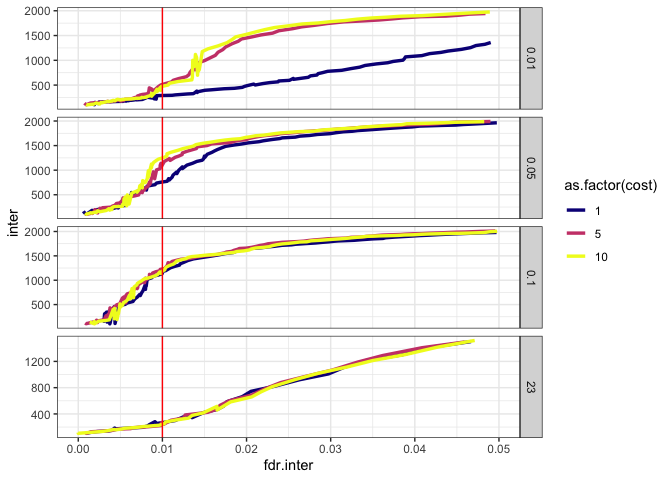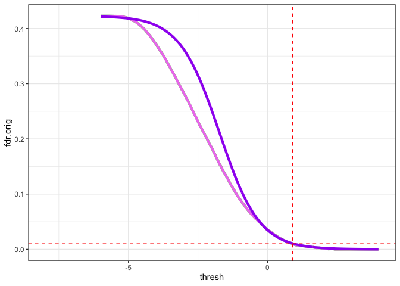

    #>    index cost gamma  interInt interHits
    #> 1      6   10  0.05 1713.7292      1129
    #> 2      8    5  0.10 1678.8571      1059
    #> 3      9   10  0.10 1676.2727      1088
    #> 4      7    1  0.10 1657.7660       990
    #> 5      5    5  0.05 1651.2800      1019
    #> 6      4    1  0.05 1537.7708       823
    #> 7      3   10  0.01 1359.5500       552
    #> 8      2    5  0.01 1292.1622       478
    #> 9     10    1 23.00  813.4211       299
    #> 10    12   10 23.00  739.2353       259
    #> 11    11    5 23.00  716.3125       248
    #> 12     1    1  0.01  699.5000       268


We can now look at URPs classified by touchstone at the target FDR of
1%:

``` r

names(ribo.tune)
#> [1] "CSMs"         "URPs"         "CSM.thresh"   "URP.thresh"   "model.params"

ribo.csm <- ribo.tune$CSMs
ribo.csm.1 <- ribo.tune$CSM.thresh

ribo.urp <- ribo.tune$URPs
ribo.urp.1 <- ribo.tune$URP.thresh

fdrPlots(ribo.urp, threshold=ribo.urp.1)
```

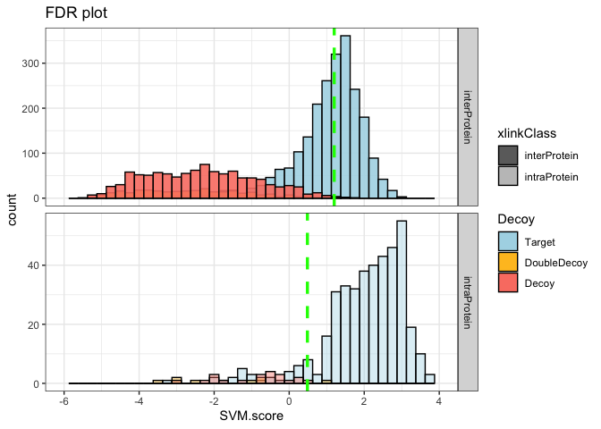

``` r
calculateFDR(ribo.urp, threshold=ribo.urp.1)
#> [1] 0.008908123

ribo.urp %>%
  countDecoys(threshold=ribo.urp.1)
#> # A tibble: 2 × 4
#> # Groups:   xlinkClass, Decoy [2]
#>   xlinkClass   Decoy Target DoubleDecoy
#>   <chr>        <int>  <int>       <int>
#> 1 interProtein     7   1129          NA
#> 2 intraProtein     4    373           1

svm.urp.inter <- ribo.urp %>% 
  countDecoys(threshold = ribo.urp.1) %>% 
  filter(xlinkClass=="interProtein") %>% 
  pull(Target)
```

So, at 1% FDR for unique-residue-pairs, Touchstone finds 1129
inter-protein cross-links. In contrast, we can ask Touchstone to
classify the data using Prospector’s `Score.Diff` parameter:

``` r

ribo.urp.sd.1 <- findSeparateThresholds(ribo.urp, classifier="Score.Diff", targetER=0.01)

fdrPlots(ribo.urp, threshold=ribo.urp.sd.1, classifier="Score.Diff")
```

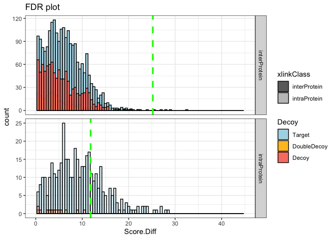

``` r
calculateFDR(ribo.urp, threshold=ribo.urp.sd.1, classifier="Score.Diff")
#> [1] 0.01034188

ribo.urp %>%
  countDecoys(threshold=ribo.urp.sd.1, classifier="Score.Diff")
#> # A tibble: 2 × 3
#> # Groups:   xlinkClass, Decoy [2]
#>   xlinkClass   Target Decoy
#>   <chr>         <int> <int>
#> 1 interProtein      4    NA
#> 2 intraProtein    113     1

sd.urp.inter <- ribo.urp %>% 
  countDecoys(threshold = ribo.urp.sd.1, classifier="Score.Diff") %>% 
  filter(xlinkClass=="interProtein") %>% 
  pull(Target)
```

The Score.Diff classifier finds 4 crosslinked residue-pairs at 1% FDR
compared to 1129 using the Touchstone scoring function.

The modulefile categorizes the 80 or so ribosomal proteins to either the
large (60S) or small (40S) subunits and specified the mapping between
the accession numbers and the pdb file. The `processModuleFile()`
function reads the modulefile, downloads the referenced pdb files,
measured euclidean distances (as well as samples random lys-lys
distances) and assigns the modules.

``` r
touchstone_example("rRibo_modfile_uniprot.txt")
#> [1] "/Library/Frameworks/R.framework/Versions/4.4-arm64/Resources/library/touchstone/extdata/rRibo_modfile_uniprot.txt"

ribo.urp <- processModuleFile(ribo.urp, touchstone_example("rRibo_modfile_uniprot.txt"))
#> Warning in bio3d::read.cif(pdbCode, verbose = F): beta version of `read.cif`.
#> please use with caution
#> Warning in bio3d::read.cif(pdbCode, verbose = F): helix/sheet records could not
#> be parsed
#>   Note: Accessing on-line CIF file
ribo.urp %>% 
  classifyDataset(ribo.urp.1) %>%
  distancePlot2(threshold = 35)
```

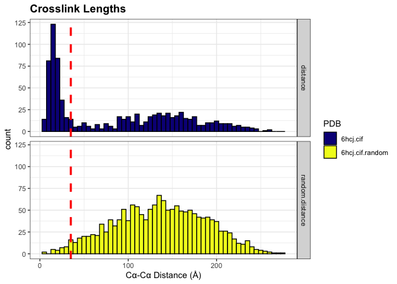

``` r

ribo.urp %>% 
  moduleTilePlot(threshold = ribo.urp.1)
```

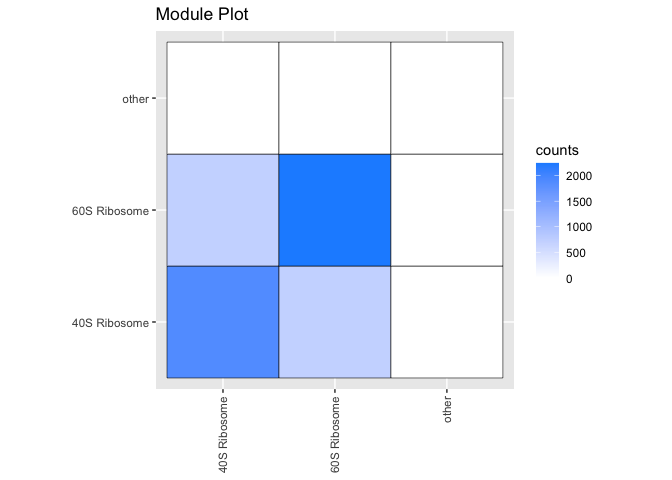 \# \#
ribo.ppi %\>% \# classifyDataset(ribo.ppi.1) %\>% \#
ggplot(aes(wtCSM)) + \# geom_histogram(color=“white”) + \#
facet_grid(rows = vars(Decoy2), scales=“free_y”) \# \# ribo.csm %\>% \#
classifyDataset(ribo.ppi.1) %\>% \# calculatePairs() %\>% \#
bestProtPair() %\>% \# ggplot(aes(wtCSM)) + \#
geom_histogram(color=“white”) + \# facet_grid(rows = vars(Decoy2),
scales=“free_y”)

Let’s say you wanted to look at unique residue pairs within each SEC
fraction. You would need to group the original data by SEC fraction and
then calculated residue pairs on the grouped data. By nesting the data
frame you can systematically calculate the 1% FDR score thresholds for
each fraction and then make a dataframe with the classified data. An
example of how one might do this is shown below.

``` r
ribo.urp_by_sec <- ribo.csm %>%
  group_by(sec_fraction) %>%
  bestResPair(retainGroups = T) %>%
  nest() %>%
  mutate(
    thresh.1 = map(data, function(x) findSeparateThresholdsModelled(x)),
    classified.urp = map2(data, thresh.1, function(x, y) {classifyDataset(x, y) %>% deScaler()})
  )
```

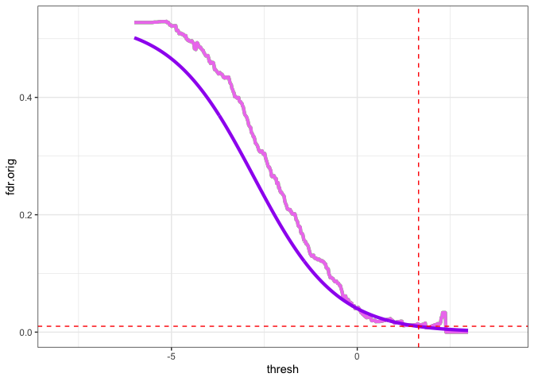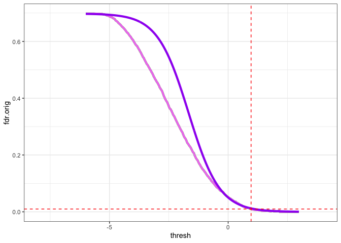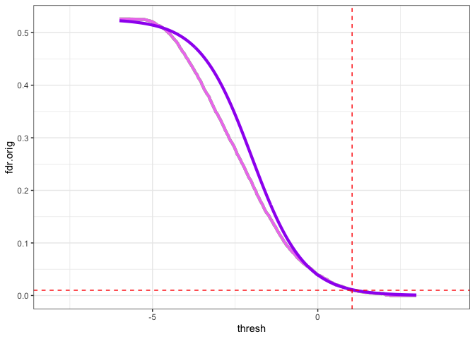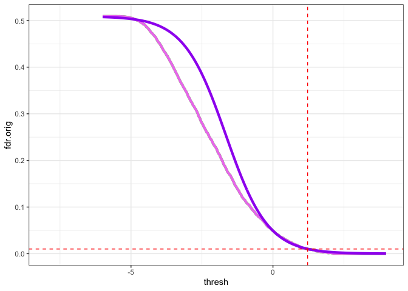

``` r

sec_plot <- ribo.urp_by_sec %>%
  select(sec_fraction, classified.urp) %>%
  unnest(cols = classified.urp) %>%
  ggplot(aes(x=sec_fraction, fill=Decoy)) +
  geom_bar(position=position_dodge2(preserve = "single")) +
    scale_fill_viridis_d(option = "C") +
  theme_bw()

print(sec_plot)
```

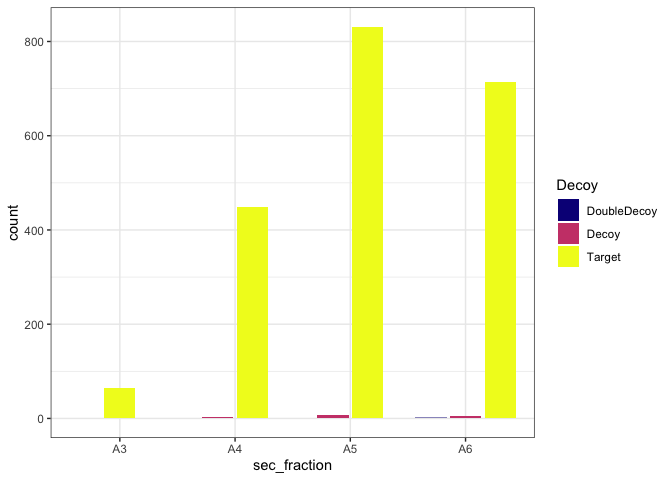

You’ll still need to render `README.Rmd` regularly, to keep `README.md`
up-to-date. `devtools::build_readme()` is handy for this.

In that case, don’t forget to commit and push the resulting figure
files, so they display on GitHub and CRAN.

## References:

<div id="refs" class="references csl-bib-body hanging-indent"
entry-spacing="0">

<div id="ref-beveridge_synthetic_2020" class="csl-entry">

Beveridge, Rebecca, Johannes Stadlmann, Josef M. Penninger, and Karl
Mechtler. 2020. “A Synthetic Peptide Library for Benchmarking
Crosslinking-Mass Spectrometry Search Engines for Proteins and Protein
Complexes.” *Nature Communications* 11 (1): 742.
<https://doi.org/10.1038/s41467-020-14608-2>.

</div>

<div id="ref-fischer_assessment_2025" class="csl-entry">

Fischer, Lutz, Lars Kolbowski, Swantje Lenz, James E. Bruce, Robert J.
Chalkley, Michael R. Hoopmann, David D. Shteynberg, et al. 2025.
“Assessment of Reported Error Rates in Crosslinking Mass Spectrometry.”
bioRxiv. <https://doi.org/10.1101/2025.04.27.649519>.

</div>

<div id="ref-kao_development_2011" class="csl-entry">

Kao, Athit, Chi-li Chiu, Danielle Vellucci, Yingying Yang, Vishal R.
Patel, Shenheng Guan, Arlo Randall, Pierre Baldi, Scott D. Rychnovsky,
and Lan Huang. 2011. “Development of a Novel Cross-Linking Strategy for
Fast and Accurate Identification of Cross-Linked Peptides of Protein
Complexes \*.” *Molecular & Cellular Proteomics* 10 (1).
<https://doi.org/10.1074/mcp.M110.002212>.

</div>

<div id="ref-matzinger_mimicked_2022" class="csl-entry">

Matzinger, Manuel, Adrian Vasiu, Mathias Madalinski, Fränze Müller,
Florian Stanek, and Karl Mechtler. 2022. “Mimicked Synthetic Ribosomal
Protein Complex for Benchmarking Crosslinking Mass Spectrometry
Workflows.” *Nature Communications* 13 (1): 3975.
<https://doi.org/10.1038/s41467-022-31701-w>.

</div>

<div id="ref-trnka_matching_2014" class="csl-entry">

Trnka, Michael J., Peter R. Baker, Philip J. J. Robinson, A. L.
Burlingame, and Robert J. Chalkley. 2014. “Matching Cross-Linked Peptide
Spectra: Only as Good as the Worse Identification \*.” *Molecular &
Cellular Proteomics* 13 (2): 420–34.
<https://doi.org/10.1074/mcp.M113.034009>.

</div>

</div>
